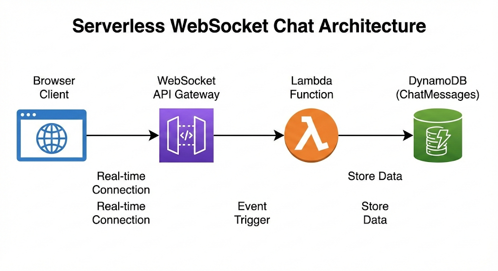
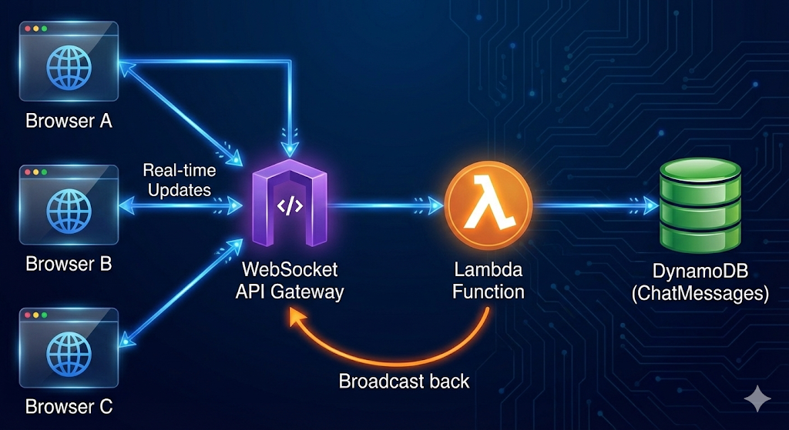

What is Websocket

WebSocket is a communication protocol providing a persistent, full-duplex (two-way) channel over a single TCP connection, enabling real-time, low-latency data exchange between a client (like a web browser) and a server, unlike traditional HTTP's request-response model. It keeps the connection open, allowing servers to push updates instantly and enabling interactive features like live chats, online gaming, and collaborative editing without constant new requests. 

Key characteristics:
        •	Persistent Connection: Once established via a handshake, the connection stays open until closed, reducing overhead.
        •	Bi-directional: Both client and server can send data at any time, in either direction.
        •	Real-time: Ideal for applications needing instant updates, such as live notifications, stock tickers, and multiplayer games.
        •	Efficient: More efficient than HTTP for real-time data as it avoids the repeated setup of new connections

How it works (Simplified):
        1.	Handshake: Client and server initiate communication using a special handshake (e.g., ws:// or wss://).
        2.	Open Connection: A single, long-lived TCP connection is established.
        3.	Data Exchange: Data flows freely in both directions until the connection is terminated. 

Common Use Cases:
        •	Chat applications (Slack, Discord, Whatsapp): Instant message delivery and status updates.
        •	Multiplayer Games: Real-time player positions and actions.
        •	Collaborative Tools: Live document editing (like Google Docs).
        •	Financial Dashboards: Real-time stock price updates.
        •	IoT Devices: Receiving instant updates from sensors

__________________________________________________________________________________________________________________________________

                                               **Project Serverless Chat –**

📘 Module 1.  Save Messages into DynamoDB (Backend Only)

🎯 Objective

    Learn how a WebSocket request from browser can be stored in DynamoDB using API Gateway + Lambda.
    At the end:
            •	Messages are saved in DB
            •	No UI output yet (this is intentional)

🧠 Architecture (Phase 1)

STEP 1 — Create DynamoDB Table
    Create a table to store chat messages. It needs because Every chat system must persist messages so they are not lost.
    
    ACTION

            AWS Console → DynamoDB → Create table
            Setting	Value
            Table name	ChatMessages
            Partition key	room_id (String)
            Sort key	timestamp (Number)
            Click Create table

STEP 2 — Create WebSocket API
    Create WebSocket-based API (not REST). Chat is real-time → WebSocket is required.
    
    ACTION
            
            API Gateway → Create API → WebSocket
            Setting	Value
            API name	chat-api
            Route selection expression	$request.body.action
            Click Create API

STEP 3 — Create Routes
    Define events that trigger Lambda. WebSocket APIs work using routes, not URLs.
    
    ACTION

            Create routes:
            $connect
            $disconnect
            sendMessage

STEP 4 — Create Lambda Function
    Lambda will process incoming chat messages. Lambda is the backend logic (serverless).
   
    ACTION
    

            Lambda → Create function

            Setting         |    Value
            Name	    |    chat_handler
            Runtime	    |    Python 3.10
            Permissions     |	Create new role

STEP 5 — Give Lambda DynamoDB Permission
    It Allow Lambda to write to DynamoDB. Lambda runs with its own identity (IAM role).
    
    ACTION
    
            IAM → Roles → chat_handler-role-*
            
            Attach policy:
            
            AmazonDynamoDBFullAccess
            
            ⏳ Wait 30 seconds

STEP 6 — Lambda Code (Save Message)
    Parse message and save it into DynamoDB. This is the core backend logic.

            import json
            import boto3
            import time

            dynamodb = boto3.resource("dynamodb")
            table = dynamodb.Table("ChatMessages")

            def lambda_handler(event, context):
                route = event["requestContext"]["routeKey"]

                if route == "sendMessage":
                    body = json.loads(event.get("body", "{}"))

                    table.put_item(Item={
                        "room_id": "global",
                        "timestamp": int(time.time()),
                        "sender": body.get("sender"),
                        "message": body.get("message")
                    })

                return {"statusCode": 200}

    Click Deploy

STEP 7 — Attach Lambda to Routes
    Connect API Gateway to Lambda as Without integration, API does nothing.
    ACTION
           
            For each route ($connect, $disconnect, sendMessage):
            •	Attach integration → Lambda → chat_handler

STEP 8 — Deploy WebSocket API

        WHAT
        Make API live.
        WHY
        Without deploy, browser cannot connect.
        ACTION
        API Gateway → Deployments → Deploy
        Stage name:
        Copy WebSocket URL:
        wss://xxxx.execute-api.ap-south-1.amazonaws.com/prod

STEP 9 — Simple Test (No UI Output)
    Send message from browser. Verify backend works.
    
    HTML

    
            const ws = new WebSocket("WSS_URL_HERE");
            ws.onopen = () => {
            ws.send(JSON.stringify({
                action:"sendMessage",
                sender:"Student",
                message:"Hello AWS"
            }));
            };
            </script>

✅ EXPECTED RESULT 
        ✔ No error
        ✔ DynamoDB has chat records
        ✔ Nothing appears on screen (correct)

--------------------------------------------------------------------------------------------------------------------------------------------------------------------------------------------------------------------

📘 Module 2
Serverless Chat – Display Messages on Web (Realtime)

🎯 Objective

        Broadcast chat messages to all connected users and show them on the web page.

🧠 Architecture (Phase 2)

STEP 1 — Create Connections Table

        WHAT
        
        Store WebSocket connection IDs.
        
        WHY
        
        To send message back, AWS needs connectionId.
        
        ACTION
        
        DynamoDB → Create table
        
         Setting	|        Value
        Table name	|        ChatConnections
        Partition key	|        connection_id (String)

STEP 2 — Update Lambda Permissions
       
        WHAT
        
        Allow Lambda to:
                •	Scan connections
                •	Push messages
       
        WHY
        
        Broadcast requires read + push access.
        
        ACTION
        
        Attach policies to Lambda role:
        
        AmazonDynamoDBFullAccess
        
        AmazonAPIGatewayInvokeFullAccess
        
        ⏳ Wait 30 seconds

STEP 3 — Final Lambda Code (Broadcast)
        WHAT
        Save message + send to all users. This is how real chat systems work.

            import json
            import boto3
            import time

            dynamodb = boto3.resource("dynamodb")
            messages = dynamodb.Table("ChatMessages")
            connections = dynamodb.Table("ChatConnections")

            def lambda_handler(event, context):
                route = event["requestContext"]["routeKey"]
                connection_id = event["requestContext"]["connectionId"]

                domain = event["requestContext"]["domainName"]
                stage = event["requestContext"]["stage"]

                api = boto3.client(
                    "apigatewaymanagementapi",
                    endpoint_url=f"https://{domain}/{stage}"
                )

                if route == "$connect":
                    connections.put_item(Item={"connection_id": connection_id})

                elif route == "$disconnect":
                    connections.delete_item(Key={"connection_id": connection_id})

                elif route == "sendMessage":
                    body = json.loads(event.get("body", "{}"))

                    sender = body.get("sender")
                    message = body.get("message")

                    messages.put_item(Item={
                        "room_id": "global",
                        "timestamp": int(time.time()),
                        "sender": sender,
                        "message": message
                    })

                    all_connections = connections.scan()["Items"]

                    for conn in all_connections:
                        try:
                            api.post_to_connection(
                                ConnectionId=conn["connection_id"],
                                Data=json.dumps({
                                    "sender": sender,
                                    "message": message
                                }).encode()
                            )
                        except:
                            connections.delete_item(
                                Key={"connection_id": conn["connection_id"]}
                            )

                return {"statusCode": 200}

        Click Deploy

STEP 4 — Redeploy WebSocket API (MANDATORY)
        API Gateway → Deployments → Deploy → prod

STEP 5 — Chat Web Page (Final UI)
        WHAT
        Display incoming messages.
        WHY
        Frontend completes the system.

✅ FINAL RESULT
        ✔ Open page in 2 browsers
        ✔ Send message
        ✔ Appears instantly in both
        🎉 Real-time serverless chat built

